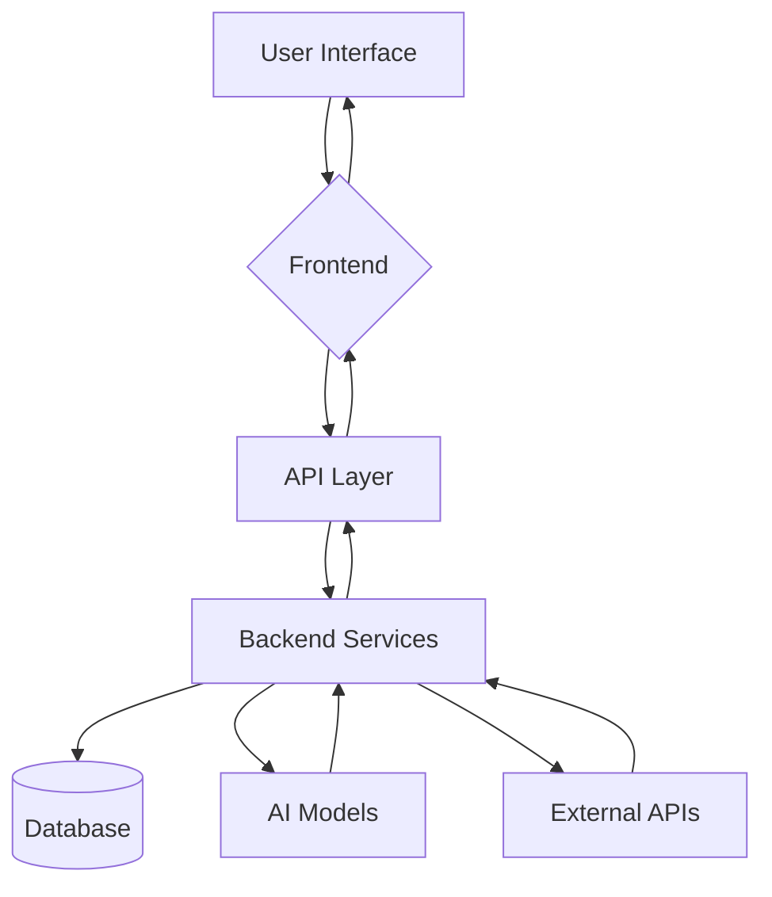

# 🎯 SyncAI (Checkmate Spec Preview)

**An AI-Powered Specification Analysis Tool with Real-Time External Data Integration**

SyncAI (Checkmate Spec Preview) is a modern full-stack application that combines Next.js 15 frontend with a Python FastAPI backend, featuring multiple AI model integrations, real-time web search capabilities, cryptocurrency market data, and enhanced chat functionality. Inspired by Sync, this application provides a sleek, modern interface with advanced animations and comprehensive AI capabilities.

## 🏗️ Project Architecture

### System Components
```
├── checkmate-spec-preview/     # Next.js 15 Frontend
│   ├── src/
│   │   ├── app/                # App Router pages and routes
│   │   ├── components/
│   │   │   └── magicui/       # Animated UI components
│   │   ├── hooks/              # Custom React hooks
│   │   └── lib/                # API client utilities
│   ├── package.json
│   └── tailwind.config.ts      # TailwindCSS 4.0 config
├── backend/                    # Python FastAPI Backend
│   ├── app/
│   │   ├── auth/               # Authentication system
│   │   ├── chat/               # Enhanced chat service
│   │   ├── external_apis/      # API integrations (Binance, Brave Search)
│   │   ├── main.py             # FastAPI application entry point
│   │   └── config.py           # Configuration management
│   ├── database_setup.py       # Database initialization and setup
│   └── requirements.txt
└── README.md                   # This file
```

### Data Flow


## ✨ Key Features

### 🤖 Multi-AI Model Integration
- **OpenAI GPT Models**: GPT-4, GPT-3.5 Turbo
- **Anthropic Claude**: Claude 3.5 Sonnet
- **Groq Models**: Ultra-fast Llama 3.1 inference
- **Streaming Responses**: Real-time AI response generation
- **Enhanced Context**: AI responses enriched with external data
- **Conversation History**: Persistent chat sessions

### 💬 Enhanced Chat Interface
- **Multi-AI Model Support**: Switch between different AI models
- **Streaming Responses**: Real-time AI response generation with typing indicators
- **Conversation History**: Persistent chat sessions with history tracking
- **Quick Prompts**: Double-click example prompts for instant submission
- **Keyboard Shortcuts**: Cmd+J/Ctrl+J to focus input from anywhere
- **Enhanced Input Area**: Modern rounded input with embedded controls
- **Voice Support**: Microphone button for voice input (Cmd+Enter/Ctrl+Enter)
- **Action Buttons**: Globe for web search, TrendingUp for crypto data

### 🌐 External API Integrations
- **Brave Search API**: Real-time web search and news
- **Binance API**: Cryptocurrency market data and trends
- **Real-Time Data**: Live market prices and trending information
- **Contextual Responses**: AI answers enhanced with current data

### 🎨 Modern Frontend
- **Next.js 15**: Latest features with App Router
- **React 19**: Modern React features
- **TypeScript**: Full type safety
- **TailwindCSS 4.0**: Modern utility-first styling
- **Dark Mode**: Animated theme toggler with smooth transitions
- **Responsive Design**: Mobile-friendly interface with slide-in sidebar
- **Real-Time UI**: WebSocket integration for live updates
- **Modern UX/UI Design**: Sync-inspired interface with glassmorphism effects
- **Advanced Animations**: Fade-in, slide-up, bounce, and gradient animations
- **Interactive Elements**: Enhanced input area with voice support and quick actions
- **Welcome Screen**: Engaging onboarding with feature cards and example prompts

### 🔐 Security & Authentication
- **JWT Authentication**: Secure token-based auth
- **User Management**: Registration and profile management
- **API Key Management**: Secure external API integration
- **CORS Configuration**: Proper cross-origin setup

## 🚀 Quick Start

### Prerequisites
- Node.js 18+ and npm/yarn
- Python 3.8+ and pip
- API Keys (optional for demo mode):
  - Groq API Key
  - Brave Search API Key
  - Binance API Key
  - OpenAI API Key
  - Anthropic API Key

### 1. Backend Setup (FastAPI)

```bash
# Navigate to backend directory
cd backend

# Create virtual environment
python3 -m venv venv
source venv/bin/activate  # On Windows: venv\Scripts\activate

# Install dependencies
pip install -r requirements.txt

# Create environment file
cp .env.example .env  # Add your API keys

# Initialize the database
python database_setup.py

# Start the backend server
python -m app.main
```

**Backend runs at:** `http://localhost:8000`  
**API Docs:** `http://localhost:8000/docs`

### 2. Frontend Setup (Next.js)

```bash
# Navigate to frontend directory
cd checkmate-spec-preview

# Install dependencies
npm install

# Install Magic UI components
npx shadcn@latest add "https://magicui.design/r/animated-theme-toggler"

# Install additional dependencies
npm install clsx tailwind-merge

# Create environment file
cp .env.local.example .env.local  # Add your API keys

# Start development server
npm run dev
```

**Frontend runs at:** `http://localhost:3000`

> Note: The frontend development server runs on port 3000 by default. If you need to change this, modify the `next.config.ts` file.

## 📋 Environment Configuration

### Backend (.env)
```bash
# AI Model APIs
GROQ_API_KEY=your_groq_api_key
OPENAI_API_KEY=your_openai_key
ANTHROPIC_API_KEY=your_anthropic_key

# External Data APIs
BRAVE_SEARCH_API_KEY=your_brave_search_key
BINANCE_API_KEY=your_binance_key
BINANCE_SECRET_KEY=your_binance_secret

# Application Settings
ENVIRONMENT=development
SECRET_KEY=your_jwt_secret_key
DATABASE_URL=sqlite+aiosqlite:///./checkmate_spec_preview.db
```

### Frontend (.env.local)
```bash
NEXT_PUBLIC_API_URL=http://localhost:8000
NEXT_PUBLIC_WS_URL=ws://localhost:8000
```

## 🔧 API Endpoints

### Authentication
- `POST /api/auth/register` - User registration
- `POST /api/auth/token` - Login and token generation
- `GET /api/auth/me` - Current user information

### Chat & AI
- `GET /api/chat/models` - Available AI models with enhanced capabilities
- `POST /api/chat/conversations` - Create conversation
- `GET /api/chat/conversations` - User conversations
- `POST /api/chat/conversations/{id}/messages` - Add message to conversation
- `POST /api/chat/conversations/{id}/chat` - Stream AI response with external data
- `GET /api/chat/capabilities` - Get enhanced chat capabilities
- `WS /api/chat/ws/{id}` - Enhanced WebSocket chat with real-time external data

### Database Models
- `User` - User accounts with preferences and API usage tracking
- `Conversation` - Chat conversations with model and external API tracking
- `Message` - Individual messages with metadata and external data tracking
- `ApiUsage` - API usage tracking for cost and limit management
- `ExternalApiCache` - Cached external API responses for performance
- `SystemSettings` - System-wide configuration settings

### External Data
- `GET /api/external/search` - Web search
- `GET /api/external/search/news` - News search
- `GET /api/external/crypto/market` - Crypto market data
- `GET /api/external/crypto/price/{symbol}` - Crypto price
- `GET /api/external/crypto/trending` - Top gainers and losers
- `GET /api/external/health` - API health status

## 🛠️ Technology Stack

### Frontend
- **Next.js 15** - React framework with App Router
- **React 19** - Latest React features
- **TypeScript** - Type safety
- **TailwindCSS 4.0** - Utility-first styling
- **Framer Motion** - Animations
- **Tanstack Query** - Data fetching
- **Zustand** - State management
- **Socket.io Client** - Real-time communication
- **Magic UI** - Animated components
- **clsx & tailwind-merge** - Conditional styling

### Backend
- **FastAPI** - Modern Python web framework
- **Pydantic** - Data validation
- **SQLAlchemy** - Database ORM
- **Uvicorn** - ASGI server
- **aiohttp** - Async HTTP client
- **WebSockets** - Real-time communication
- **JWT** - Authentication
- **SQLite** - Development database
- **Async Database Support** - aiosqlite for async operations

### External APIs
- **Groq** - Ultra-fast AI inference
- **OpenAI** - GPT models
- **Anthropic** - Claude models
- **Brave Search** - Web search and news
- **Binance** - Cryptocurrency data

## 🎨 Design System

### Dark Mode Theme
- **Primary Background**: HSL gray-1000 (hsl(210 11% 6%))
- **Secondary Backgrounds**: gray-950, gray-900
- **Interactive Elements**: gray-850, gray-800
- **Smooth Transitions**: 300ms color transitions
- **System Preference**: Auto-detection with localStorage persistence

### Components
- Modern chat interface with animated theme toggler
- Real-time streaming responses
- Loading states and typing indicators
- Responsive design for all screen sizes
- Accessible color contrast ratios
- Animated UI components from Magic UI

### Sidebar Features
- **Responsive Design**: Desktop sidebar with collapsible functionality
- **Mobile Support**: Slide-in overlay for mobile devices
- **Chat History**: Persistent conversation tracking
- **User Status**: Online indicator with Twitter/X logo
- **Theme Toggle**: Dark/light mode switcher in sidebar

## 🧪 Testing & Validation

### Frontend Tests
```bash
npm run lint          # ESLint validation
npm run build         # TypeScript compilation
npm run type-check    # Type checking
```

### Backend Tests
```bash
pytest                # Run test suite
pytest --cov         # Coverage report
mypy app/            # Type checking
```

## 🚀 Deployment

### Frontend (Vercel)
```bash
npm run build
npm start
```

### Backend (Docker)
```dockerfile
FROM python:3.11-slim
WORKDIR /app
COPY requirements.txt .
RUN pip install -r requirements.txt
COPY . .
RUN python database_setup.py
CMD ["uvicorn", "app.main:app", "--host", "0.0.0.0", "--port", "8000"]
```

## 📚 Usage Examples

### Chat with AI Models
```typescript
// Frontend API call
const response = await api.post('/chat/conversations/123/chat', {
  message: "What's the current Bitcoin price?",
  model_id: "groq-llama-3.1-70b"
});
```

### Search Integration
```python
# Backend service
search_results = await brave_search.search("latest AI developments")
crypto_data = await binance_service.get_market_data()
```

## 🤝 Contributing

1. Fork the repository
2. Create feature branch (`git checkout -b feature/amazing-feature`)
3. Commit changes (`git commit -m 'Add amazing feature'`)
4. Push to branch (`git push origin feature/amazing-feature`)
5. Open Pull Request

## 📄 License

This project is licensed under the MIT License - see the [LICENSE](LICENSE) file for details.

## 🆘 Support

- **Documentation**: Check the API docs at `/docs`
- **Issues**: Report bugs via GitHub Issues
- **Health Check**: Monitor API status at `/health`

## 🎯 Project Status

Checkmate Spec Preview is currently in active development with regular updates and improvements. The application features a complete database schema with user management, conversation tracking, and API usage monitoring. It is fully functional with mock data for demonstration purposes, and can be easily connected to real AI APIs and external services by configuring the appropriate API keys.

## 📈 Future Enhancements

- Real API integration for chat functionality
- Advanced message formatting (markdown, code blocks)
- File upload and image processing
- Voice recording and playback
- Chat export and sharing features
- Plugin system for extended functionality

---

**Built with ❤️ using Next.js 15, FastAPI, and modern AI technologies**# synx-agent-preview
